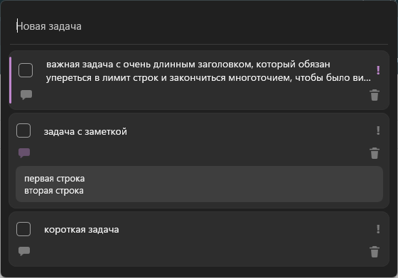
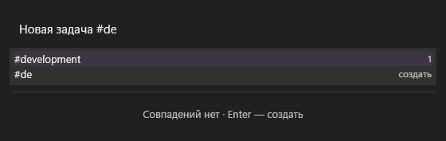
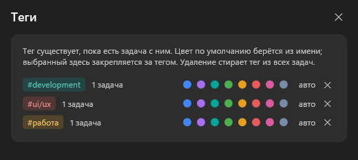
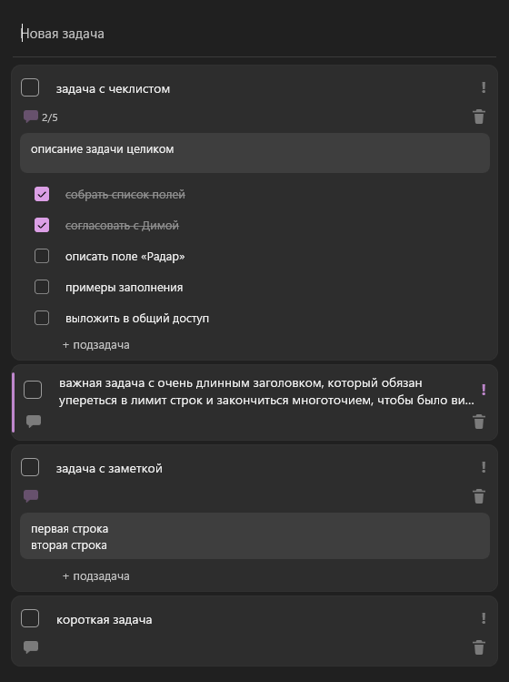
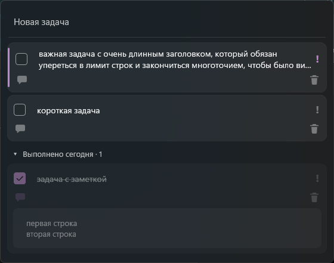

# QuickJot

Резидентное приложение быстрого захвата задач для Windows 10/11. Висит в трее, по глобальному хоткею всплывает поверх всех окон с уже мигающей кареткой в поле ввода.

Смысл ровно один: **успеть записать мысль, пока она не убежала**. От нажатия хоткея до готовности печатать — 22 мс на живом замере.



## Что умеет

- **Глобальный хоткей** (`Ctrl+Alt+Space` по умолчанию, настраивается) — показать, вернуть фокус, спрятать. При скрытии фокус возвращается тому окну, из которого вы пришли.
- **Поле ввода одновременно создаёт и фильтрует.** `Enter` создаёт задачу всегда, даже при точном совпадении с существующей; совпадения в списке подсвечиваются. Недописанный текст переживает закрытие окна.
- **Заметки** — раскрываются по `Tab`, живут в карточке, разворот запоминается между открытиями.
- **Чеклист внутри задачи.** Большую задачу можно разложить на мини-задачи; пункты живут под заметкой. Клавиши те же, что у списка задач. Поиск ищет и по пунктам. Сколько пунктов видно без прокрутки — в настройках, чтобы длинный список не растянул одну задачу на всё окно.
- **Теги.** Пишутся прямо в строке задачи: `Перенести радар #работа`. По `#` открывается подсказка с существующими тегами и числом задач у каждого; `Tab` подставляет, а если такого тега ещё нет — та же строка его создаёт. Клик по чипу отбирает задачи с этим тегом. Цвет считается из имени, а в окне «Теги» (меню в трее) его можно закрепить вручную и удалить тег сразу из всех задач.
- **Карточка без иконок.** Ни мусорки, ни служебных значков: заметка и пункты видны сами, когда они есть, а задача без них — это одна строка.
- **Важность** полоской по левому краю, ручной порядок drag&drop и `Alt+↑↓`.
- **Блок «Выполнено сегодня»** — выполненная задача уезжает туда через 1.5 секунды и возвращается на прежнее место, если снять галочку. Сбрасывается по локальной полуночи.
- **Отмена и повтор** 20 последних операций, `Ctrl+Z` / `Ctrl+Shift+Z`, с тостом «Задача удалена · Отменить».
- **Четыре угла привязки.** При нижних углах раскладка зеркалится: поле ввода снизу, список растёт вверх — как в мессенджере.
- **Автозапуск** при входе в систему через Планировщик заданий, при желании с правами администратора.
- Полностью с клавиатуры, `F1` — шпаргалка.









## Горячие клавиши

| Где | Клавиши |
|---|---|
| Поле ввода | `Enter` — создать · `Ctrl+Enter` — создать и закрыть · `Tab` — заметка · `↓` — в список · `Esc` — скрыть |
| Подсказка тегов | `#` — открыть · `↑↓` — выбрать · `Tab` — подставить · `Esc` — закрыть |
| Список | `↑↓` — навигация · `Space` — выполнить · `Enter` — правка · `Delete` — удалить · `→` `←` — заметка · `Alt+↑↓` — переставить · `Ctrl+I` — важность |
| Чеклист | `Tab` — вглубь карточки: заметка, затем пункты · дальше те же клавиши, что в списке · `Esc` — назад на карточку |
| Везде | `Ctrl+Alt+Space` — показать и скрыть · `Ctrl+Z` — отменить · `F1` — справка |

## Сборка

Нужен .NET 10 SDK. Готовый файл самодостаточен — рантайм внутри, на чистой Windows запустится.

```bash
dotnet publish src\QuickJot -c Release -p:PublishProfile=SingleFile
```

Результат — `publish\QuickJot.exe` (~68 МБ, single-file, self-contained).

## Проверки

Без фреймворков: обычная программа, падает с ненулевым кодом.

```bash
dotnet run --project tests\QuickJot.Tests
```

Двадцать проверок на то, что в этом приложении нетривиально: исчерпание точности `sort_order`, метки времени в UTC, фильтр и черновик, задержка перед уходом в «Выполнено», сброс блока по подменённой полуночи, отмена каждого типа операции и глубина стека, зеркальный порядок при нижних углах, разбор комбинации хоткея, перетаскивание, формат чеклиста и его отмена, разбор `#тегов` из строки ввода и их удаление из всех задач, а также то, что задачи лежат в самой `tasks.db`, а не только в её файле-спутнике.

## Данные

`%APPDATA%\QuickJot\tasks.db` — SQLite в режиме WAL, запись на каждое действие. При старте туда же кладётся копия базы (`backups\`, хранятся последние пять). Выполненные задачи из базы не удаляются, удалённые чистятся физически через сутки.

Путь к открытой базе приложение пишет в `log.txt` при каждом старте. Это не для красоты: если запустить exe из терминала **упакованного** приложения (MSIX), Windows перенаправляет его `%APPDATA%` в песочницу этого приложения — тот же файл, тот же ярлык, но база другая, и список выглядит пустым. Строка в логе показывает, какая база открыта на самом деле.

Отладочный режим, чтобы гонять интерфейс не трогая рабочую базу:

```bash
set QUICKJOT_DEV=%TEMP%\quickjot-dev.db
```

## Устройство

```
src/QuickJot/
  App.xaml.cs          трей, единственный экземпляр, прогрев окна, хоткей
  MainWindow.xaml      окно задач: поле ввода, карточки, блок выполненного
  SettingsWindow.xaml  настройки
  Win32.cs             хоткей на message-only окне, показ с фокусом, Mica
  Placement.cs         углы привязки, мультимонитор, per-monitor DPI
  Theme.cs             палитра поверх Mica для светлой и тёмной темы
  Data/                SQLite, схема, репозиторий задач, настройки
  ViewModels/          логика списка, стек отмены
tests/QuickJot.Tests/  проверки
```

## Документы

- [Спецификация](spec-quick-tasks.md) — что и почему устроено именно так, включая известные ограничения платформы.
- [План разработки](plan-v1.md) — десять этапов, по которым это собиралось.

Дальше по дорожной карте: сроки и напоминания (v2), проекты и теги (v3).
